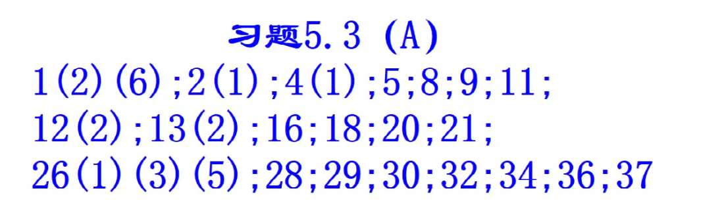
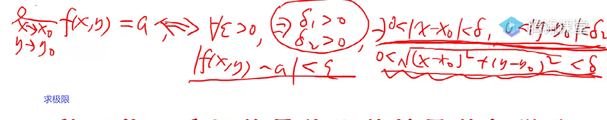
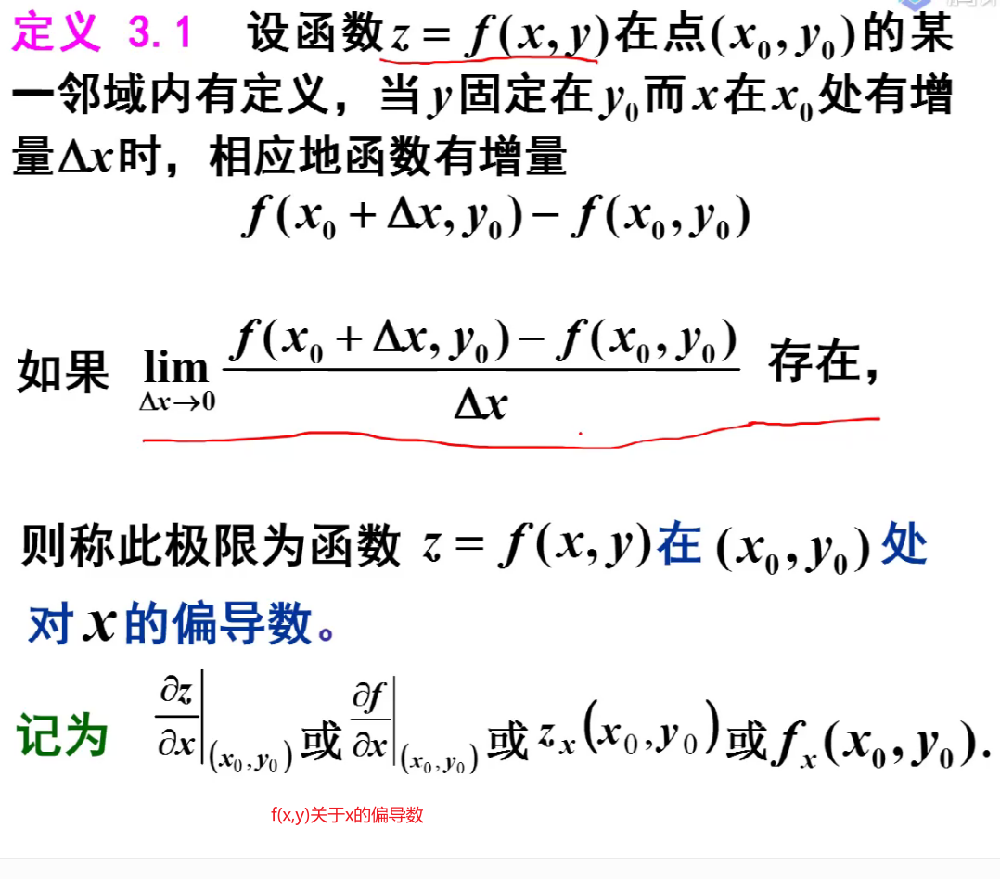
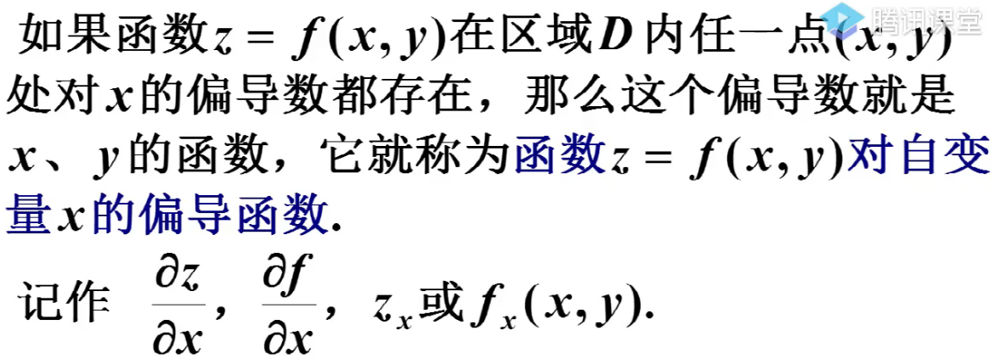
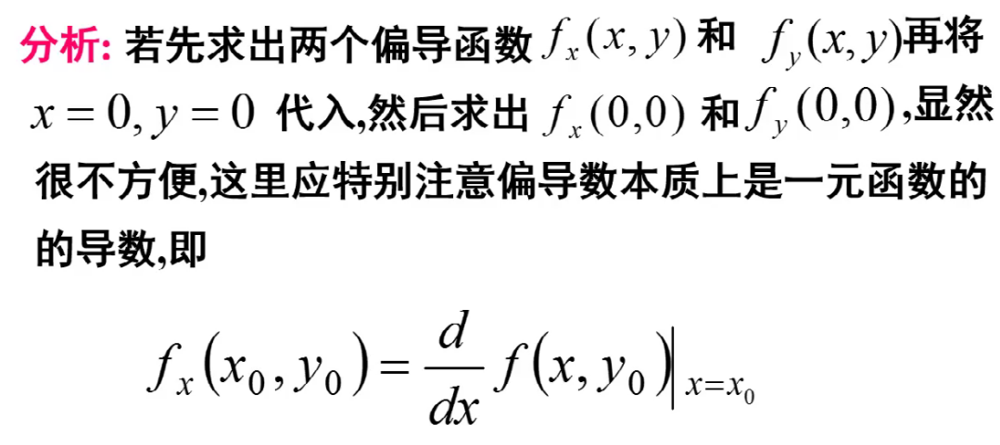
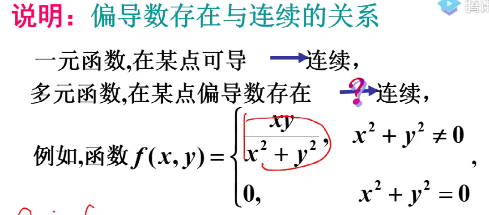
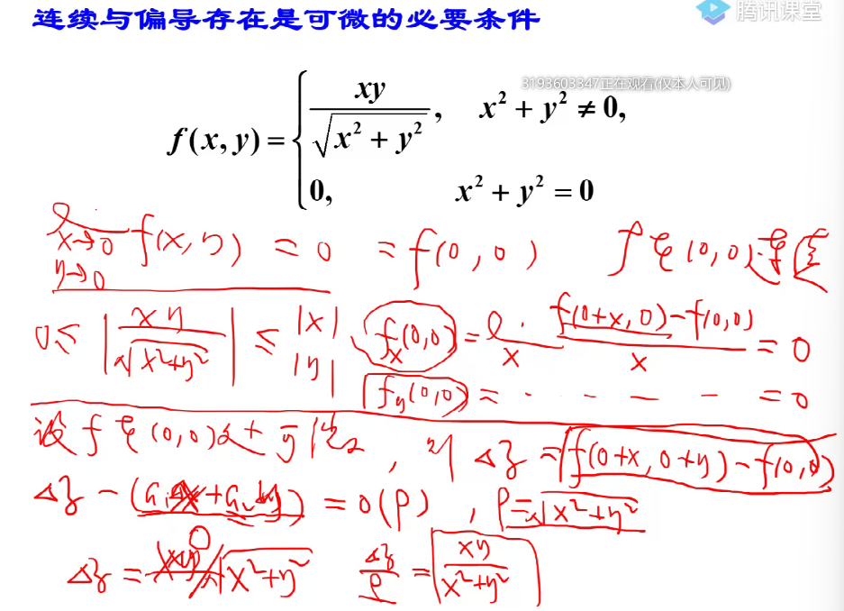

# 多元数量值函数的导数和微分

作业：

## 偏导数

0$$
\lim_{x\to x_0}f(x,y)=a\iff \exist \delta_1>0,\delta_2>0
$$

一元函数可理解为微分之商，而偏导数不能

固定其他变量不动，改变某一变量

$\because f(x,0)=2x,\therefore f_x(x,0)=2，f_x(0,0)=2;\\
f(0,y)=3y,\therefore f_y(0,0)=3$

### 偏导数存在与连续的关系

**偏导数存在的条件非常弱，可以偏导的点可能连极限都不存在**
$$\lim_{x\to 0\atop y\to 0}不存在\\但是f_x(0,0),f_y(0,0)=0$$
**同时，连续也不一定可偏导**

### 偏导数的几何意义

略

## 全微分

==一元函数==
$
一元函数可微\iff \exist 与\Delta x无关的A,使得\Delta y=f(x_0+\Delta x)-f(x_0)=A\Delta x+o(\Delta x)
$
==多元函数==
$z=f(x,y)在(x_0,y_0)可微\iff \exist 与\Delta x,\Delta y无关的a_1,a_2，\\使得\Delta z=f(x_0+\Delta x,y_0+\Delta y)-f(x_0,y_0)=a_1\Delta x+a_2\Delta y+o(\Rho)\\\rho=\sqrt{(\Delta x)^2+(\Delta y)^2}$

### 可微的必要条件

1. f在$(x_0,y_0)$连续
2. f在$(x_0,y_0)$两个偏导数均存在，且$a_1=f_x(x_0,y_0),a_2=f_y(x_0,y_0)$

### 可微的判定定理

设函数偏导数在该点存在，且有$\Delta z-f_x(x_0,y_0)\Delta x-f_y(x_0,y_0)\Delta y=o(\rho)$

$$dz=f_xdx+f_ydy$$