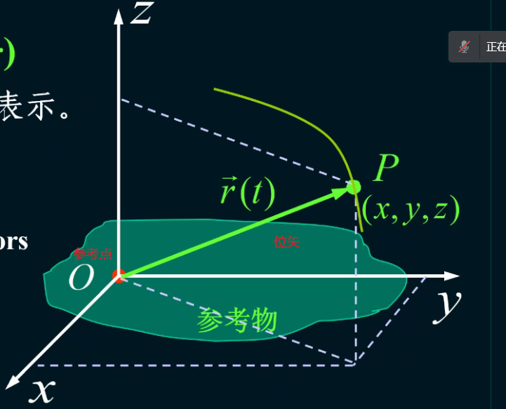

# 质点运动学

## 基本概念

### [==质点(particle)==](#list1)

#### 质点的概念

- 无大小和形状的几何点
- 具有质量

#### 性质

- 理想模型
- 对实际物体的有条件和合理的抽象

### ==质点系(system of particles)==

#### 质点系的概念

若干质点的集合

### 参照系

参照物+坐标系（定量描述）

#### 坐标系分类

- 直角坐标系$(x,y,z,t)$
- 球坐标系$(r(t),\theta(t),\phi(t))$
- 自然坐标系$s=s(t)$
    >如火车行驶
    >

## <a id="list1">质点</a>

### 运动的描述

#### 位置矢量(Positive Vector)

运动学方程:
$$
\vec{r}=\vec{r(t)}
$$

#### 位移(Displacement)

$$\vec{pp^{'}}=\vec{r}(t+\Delta t)-\vec{r}(t)=\Delta\vec{r}$$

性质：

- 位移是矢量
- 位移与原点的选取无关
- $|\Delta {\vec{r}|}\ne {|s|}$

#### 速度(velocity)

性质：

1. 速度有矢量性和相对性

##### 平均速度(average velocity)

##### 瞬时速度(Instantaneous velocity)

