# 张载

## 张载其人

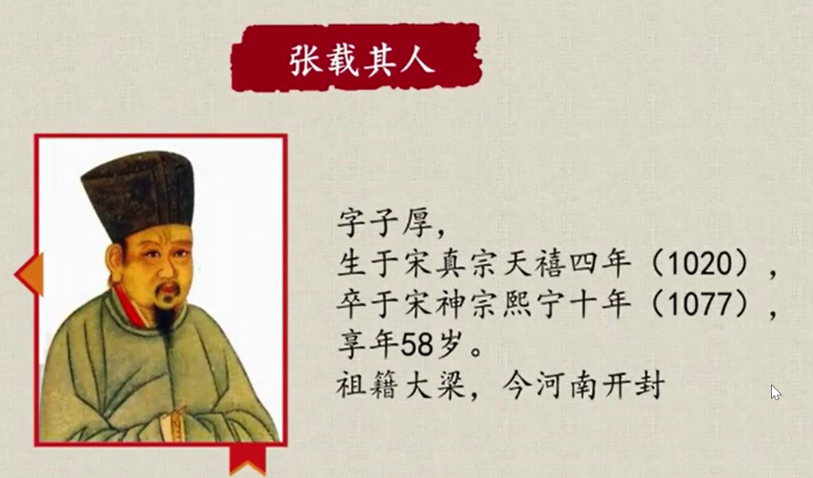

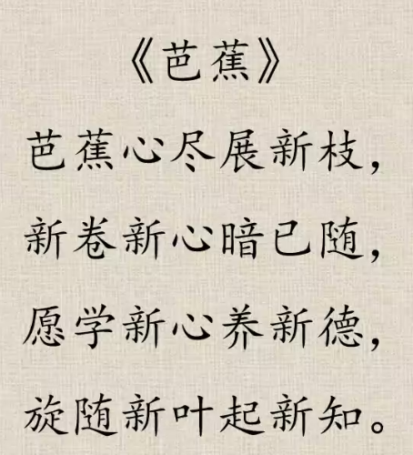

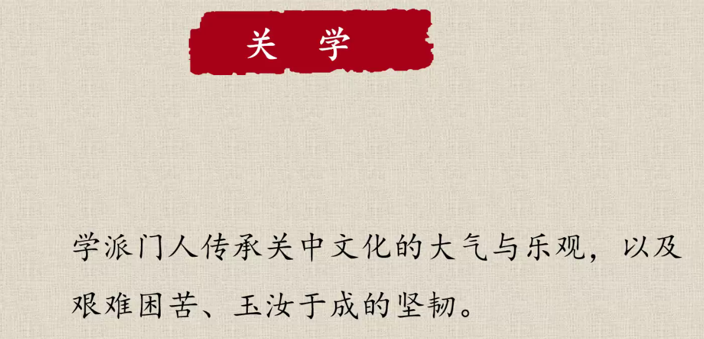

艰难困苦，玉汝于成

## 正蒙

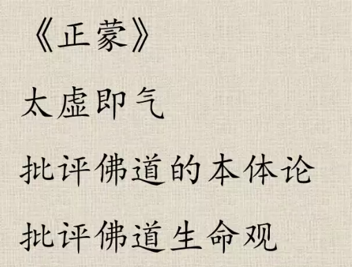  
张载晚期的集大成之作  
批评了佛道的本体论与生命观。

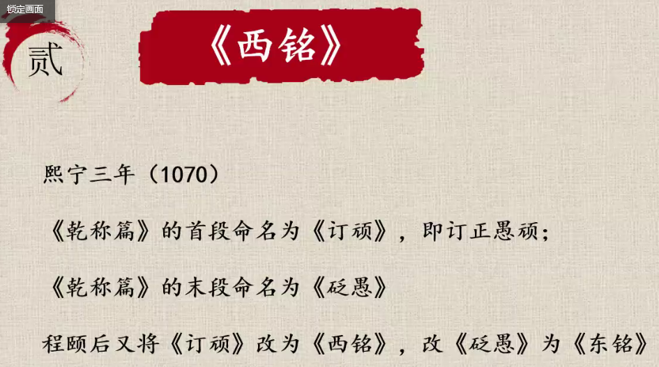
熙宁三年因弟弟反对王安石变法被贬官。

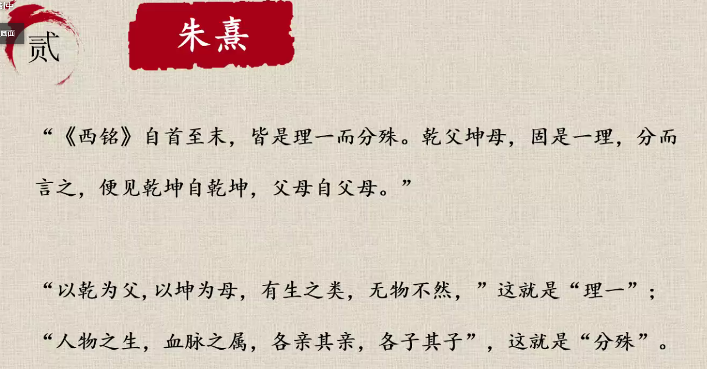

《西铭》篇原文：
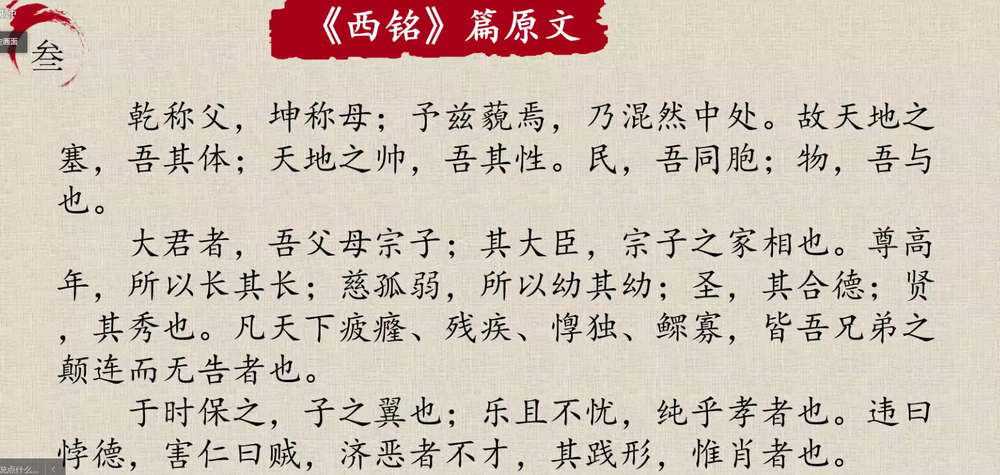
乾称父，坤称母；予兹邈焉，乃浑然中处。  
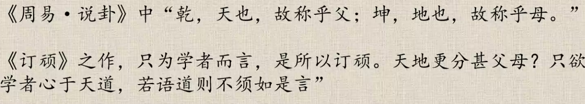  
敬畏天地。天道不息，君子以厚德载物；地势坤

==民胞物与==
所有人都是同胞，所有物都是相同的。

>是墨家的兼爱？
>还是儒家的亲疏有别、尊卑有序？

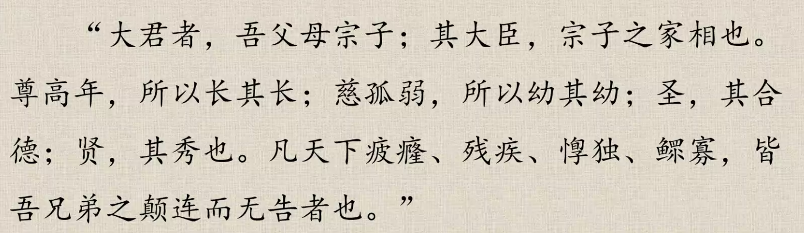

### 正视差异

大君：天子  
乾坤为父母，

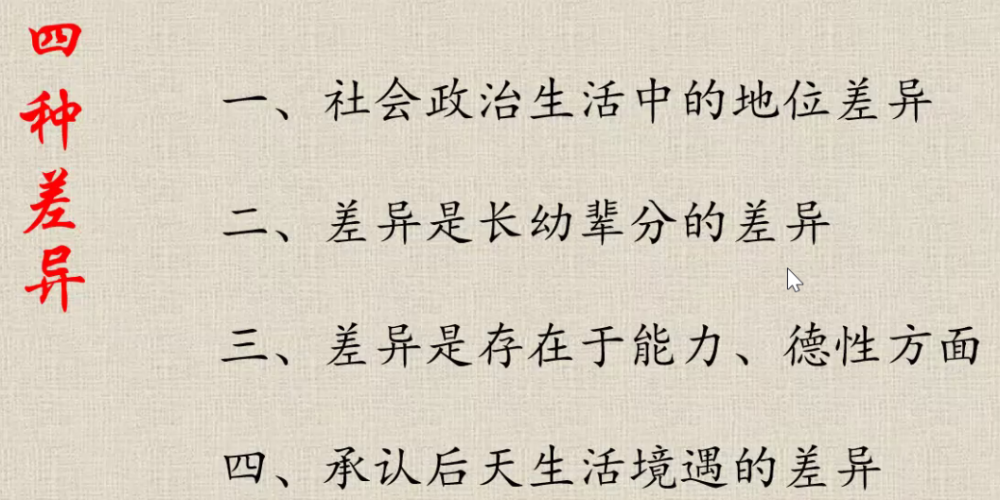

1. 社会地位的差异
2. 长幼辈分的差异
3. 能力德行的差异
4. 生活境遇的差异

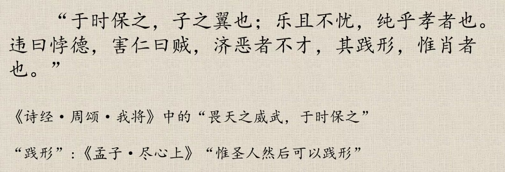
践行：
内外一致
“在貌曰恭，在心曰敬”——《礼记》

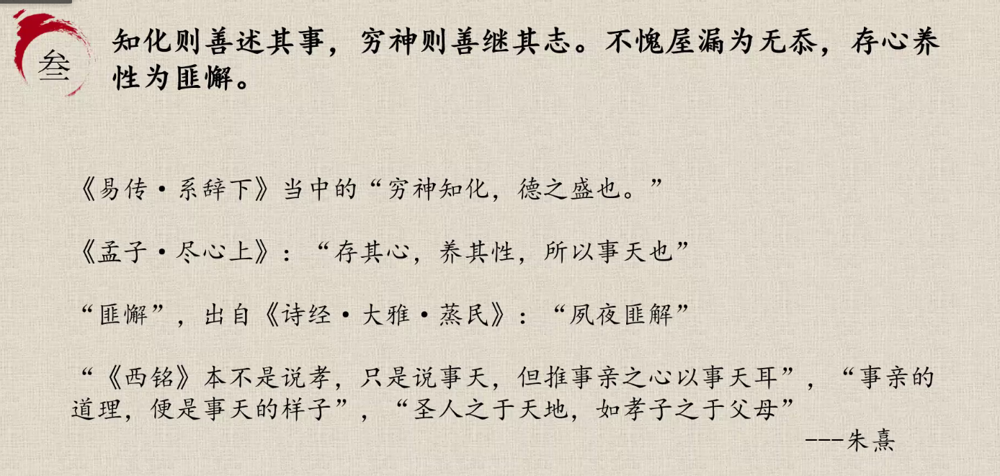
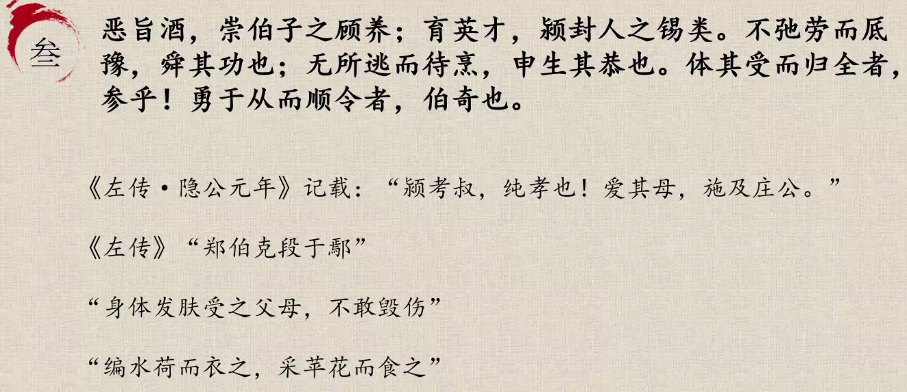
经->传->书

道德审判动机，法律审判结果

故而君子慎独

知屋漏者在雨下

存心养性

崇伯子：大禹，崇伯的儿子  
大禹不因饮酒而放弃理智。

网络资源：[录播](https://meeting.tencent.com/v2/cloud-record/share?id=1faf543b-4503-44a8-89ff-4bc2cb6e108b&from=3)  
H~2~O
<!-- 这是注释 -->
```flow
st=>start
```