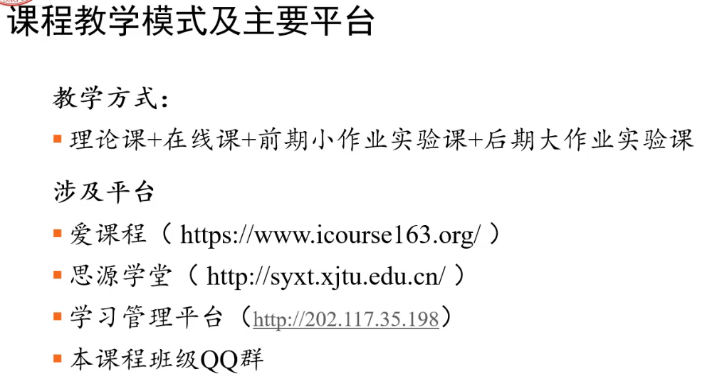
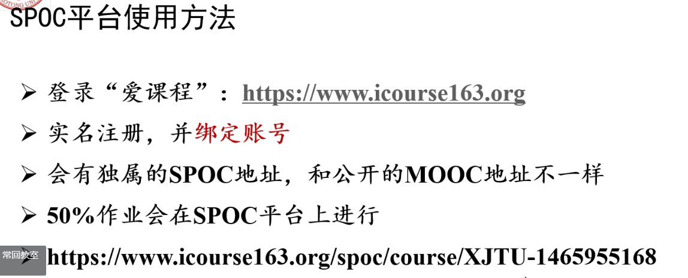
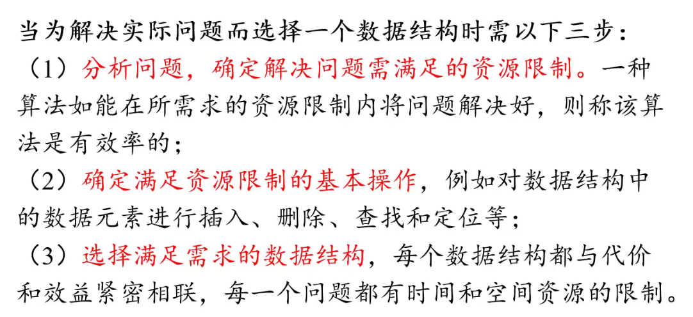
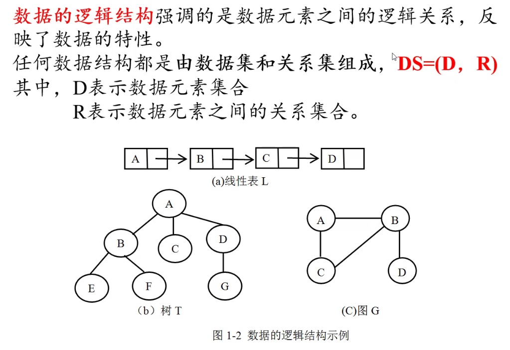
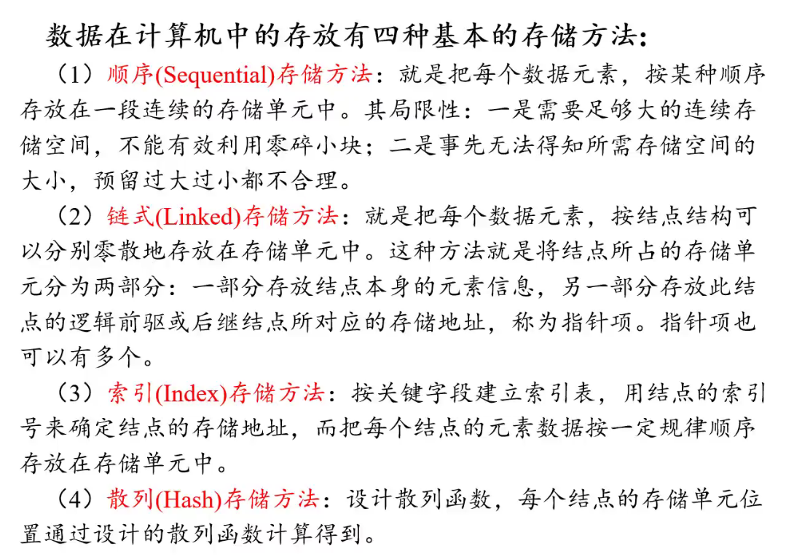

# base_knowledge

## foreword

the computers **Not only do calculations, but more importantly store, retrieve and process information.**

<u>what is data structure and algorithms?</u>

for example:
*how to arrange our book?*

- randomly
- by their first letters
- **by catagories**
    >how to sort?

## base_concept

==the process to solve a concrete problem:==

1. analyze the concrete problem and abstract a proper mathematical mode
   - the source limit
2. design a proper data structure
    - determine the proper basic operation
3. design and implement the concrete algorithms

==basic concepts and terms==

1. data: all the objects that computers can receive process
2. data element: The objects that computers consider and process as a whole
3. data object: the set of data elements that has ths the same characteristic
   - set of nature numbers
    >N={1,2,3···}
   - set of letters
    >Letters={A,B,C...,a,b,...}
4. data structure(DS)
    - logic structure
    - storage structure
    - operation implementation

### logic structure

linear structure and nonlinear structure

The deeper you go, the stricter the requirement is.

- data set
- relationship
  
### four types of storage

- sequential
- linked
- index
- hash

==how to choose a data structure?==

## problem, algorithms and program

## algorithmic amalysis overview
